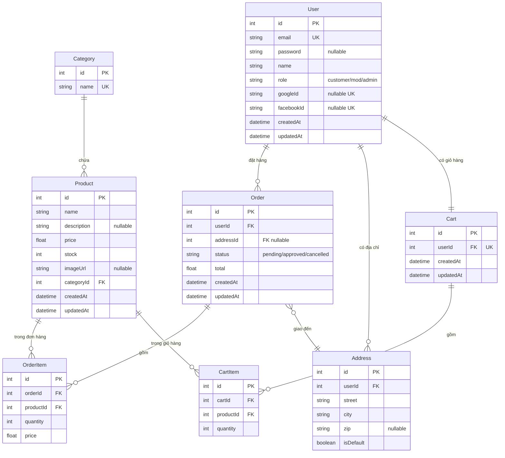

# Thiết kế Chi tiết — v1

## Metadata

| Trường        | Giá trị                           |
|---------------|-----------------------------------|
| Version       | v1                                |
| Sinh lúc      | 2026-05-25 21:00                  |
| Schema source | backend/prisma/schema.prisma      |
| Models        | 7                                 |
| Fields tổng   | 46                                |
| Relations     | 9                                 |

---

## INPUT

### Source: `backend/prisma/schema.prisma`

```prisma
generator client {
  provider = "prisma-client-js"
}

datasource db {
  provider = "mysql"
  url      = env("DATABASE_URL")
}

model User {
  id         Int      @id @default(autoincrement())
  email      String   @unique
  password   String?
  name       String
  role       String   @default("customer") // customer, mod, admin
  googleId   String?  @unique
  facebookId String?  @unique
  createdAt  DateTime @default(now())
  updatedAt  DateTime @updatedAt

  orders    Order[]
  addresses Address[]
  cart      Cart?
}

model Category {
  id   Int    @id @default(autoincrement())
  name String @unique

  products Product[]
}

model Product {
  id          Int      @id @default(autoincrement())
  name        String
  description String?
  price       Float
  stock       Int      @default(0)
  imageUrl    String?
  categoryId  Int
  createdAt   DateTime @default(now())
  updatedAt   DateTime @updatedAt

  category   Category    @relation(fields: [categoryId], references: [id])
  orderItems OrderItem[]
  cartItems  CartItem[]
}

model Order {
  id        Int      @id @default(autoincrement())
  userId    Int
  addressId Int?
  status    String   @default("pending") // pending, approved, cancelled
  total     Float
  createdAt DateTime @default(now())
  updatedAt DateTime @updatedAt

  user       User        @relation(fields: [userId], references: [id])
  address    Address?    @relation(fields: [addressId], references: [id])
  orderItems OrderItem[]
}

model OrderItem {
  id        Int   @id @default(autoincrement())
  orderId   Int
  productId Int
  quantity  Int
  price     Float

  order   Order   @relation(fields: [orderId], references: [id])
  product Product @relation(fields: [productId], references: [id])
}

model Address {
  id        Int     @id @default(autoincrement())
  userId    Int
  street    String
  city      String
  zip       String?
  isDefault Boolean @default(false)

  user   User    @relation(fields: [userId], references: [id])
  orders Order[]
}

model Cart {
  id        Int      @id @default(autoincrement())
  userId    Int      @unique
  createdAt DateTime @default(now())
  updatedAt DateTime @updatedAt

  user      User       @relation(fields: [userId], references: [id])
  cartItems CartItem[]
}

model CartItem {
  id        Int @id @default(autoincrement())
  cartId    Int
  productId Int
  quantity  Int

  cart    Cart    @relation(fields: [cartId], references: [id])
  product Product @relation(fields: [productId], references: [id])
}
```

---

## OUTPUT

### 1. Danh sách Models

#### Model: `User`

| Field      | Type     | Constraint              | Mô tả                        |
|------------|----------|-------------------------|------------------------------|
| id         | Int      | PK, autoincrement       | Khóa chính                   |
| email      | String   | UNIQUE, NOT NULL        | Email đăng nhập              |
| password   | String?  | nullable                | Null nếu đăng nhập OAuth     |
| name       | String   | NOT NULL                | Tên hiển thị                 |
| role       | String   | default "customer"      | customer / mod / admin       |
| googleId   | String?  | UNIQUE, nullable        | Google OAuth ID              |
| facebookId | String?  | UNIQUE, nullable        | Facebook OAuth ID            |
| createdAt  | DateTime | default now()           | Thời điểm tạo                |
| updatedAt  | DateTime | auto-update             | Thời điểm cập nhật cuối      |

**Quan hệ:**
- `orders` → `Order[]` (1-N: một user có nhiều đơn hàng)
- `addresses` → `Address[]` (1-N: một user có nhiều địa chỉ)
- `cart` → `Cart?` (1-1: một user có một giỏ hàng, nullable)

---

#### Model: `Category`

| Field | Type   | Constraint        | Mô tả            |
|-------|--------|-------------------|------------------|
| id    | Int    | PK, autoincrement | Khóa chính       |
| name  | String | UNIQUE, NOT NULL  | Tên danh mục     |

**Quan hệ:**
- `products` → `Product[]` (1-N: một danh mục chứa nhiều sản phẩm)

---

#### Model: `Product`

| Field       | Type     | Constraint              | Mô tả                   |
|-------------|----------|-------------------------|-------------------------|
| id          | Int      | PK, autoincrement       | Khóa chính              |
| name        | String   | NOT NULL                | Tên sản phẩm            |
| description | String?  | nullable                | Mô tả sản phẩm          |
| price       | Float    | NOT NULL                | Giá bán                 |
| stock       | Int      | default 0               | Số lượng tồn kho        |
| imageUrl    | String?  | nullable                | URL ảnh sản phẩm        |
| categoryId  | Int      | FK → Category.id        | Danh mục thuộc về       |
| createdAt   | DateTime | default now()           | Thời điểm tạo           |
| updatedAt   | DateTime | auto-update             | Thời điểm cập nhật cuối |

**Quan hệ:**
- `category` → `Category` (N-1: nhiều sản phẩm thuộc một danh mục)
- `orderItems` → `OrderItem[]` (1-N: sản phẩm xuất hiện trong nhiều dòng đơn hàng)
- `cartItems` → `CartItem[]` (1-N: sản phẩm xuất hiện trong nhiều giỏ hàng)

---

#### Model: `Order`

| Field     | Type     | Constraint              | Mô tả                           |
|-----------|----------|-------------------------|---------------------------------|
| id        | Int      | PK, autoincrement       | Khóa chính                      |
| userId    | Int      | FK → User.id            | User đặt hàng                   |
| addressId | Int?     | FK → Address.id, nullable | Địa chỉ giao hàng (có thể null) |
| status    | String   | default "pending"       | pending / approved / cancelled  |
| total     | Float    | NOT NULL                | Tổng tiền đơn hàng              |
| createdAt | DateTime | default now()           | Thời điểm đặt hàng              |
| updatedAt | DateTime | auto-update             | Thời điểm cập nhật cuối         |

**Quan hệ:**
- `user` → `User` (N-1: nhiều đơn hàng của một user)
- `address` → `Address?` (N-1 optional: đơn hàng giao đến một địa chỉ)
- `orderItems` → `OrderItem[]` (1-N: một đơn hàng có nhiều dòng sản phẩm)

---

#### Model: `OrderItem`

| Field     | Type  | Constraint        | Mô tả                    |
|-----------|-------|-------------------|--------------------------|
| id        | Int   | PK, autoincrement | Khóa chính               |
| orderId   | Int   | FK → Order.id     | Đơn hàng chứa            |
| productId | Int   | FK → Product.id   | Sản phẩm                 |
| quantity  | Int   | NOT NULL          | Số lượng mua             |
| price     | Float | NOT NULL          | Giá tại thời điểm đặt    |

**Quan hệ:**
- `order` → `Order` (N-1)
- `product` → `Product` (N-1)

> `price` được lưu riêng (không lấy từ Product.price) để giữ lịch sử giá khi đặt hàng.

---

#### Model: `Address`

| Field     | Type    | Constraint        | Mô tả                       |
|-----------|---------|-------------------|-----------------------------|
| id        | Int     | PK, autoincrement | Khóa chính                  |
| userId    | Int     | FK → User.id      | Chủ địa chỉ                 |
| street    | String  | NOT NULL          | Số nhà, tên đường           |
| city      | String  | NOT NULL          | Thành phố / tỉnh            |
| zip       | String? | nullable          | Mã bưu chính (tùy chọn)     |
| isDefault | Boolean | default false     | Địa chỉ mặc định của user   |

**Quan hệ:**
- `user` → `User` (N-1)
- `orders` → `Order[]` (1-N: địa chỉ được dùng cho nhiều đơn hàng)

---

#### Model: `Cart`

| Field     | Type     | Constraint              | Mô tả              |
|-----------|----------|-------------------------|--------------------|
| id        | Int      | PK, autoincrement       | Khóa chính         |
| userId    | Int      | UNIQUE, FK → User.id    | Chủ giỏ hàng (1-1) |
| createdAt | DateTime | default now()           | Thời điểm tạo      |
| updatedAt | DateTime | auto-update             | Lần cập nhật cuối  |

**Quan hệ:**
- `user` → `User` (1-1 qua userId UNIQUE)
- `cartItems` → `CartItem[]` (1-N)

---

#### Model: `CartItem`

| Field     | Type | Constraint        | Mô tả               |
|-----------|------|-------------------|---------------------|
| id        | Int  | PK, autoincrement | Khóa chính          |
| cartId    | Int  | FK → Cart.id      | Giỏ hàng chứa       |
| productId | Int  | FK → Product.id   | Sản phẩm            |
| quantity  | Int  | NOT NULL          | Số lượng trong giỏ  |

**Quan hệ:**
- `cart` → `Cart` (N-1)
- `product` → `Product` (N-1)

---

### 2. Sơ đồ quan hệ (ERD)



---

### 3. Thiết kế API Endpoints

#### Auth (`/auth`)

| Method | Endpoint              | Auth     | Body                              | Response                    |
|--------|-----------------------|----------|-----------------------------------|-----------------------------|
| POST   | /auth/register        | public   | `{email, password, name}`         | `{user}`                    |
| POST   | /auth/login           | public   | `{email, password}`               | `{token, user}`             |
| GET    | /auth/google          | public   | —                                 | redirect OAuth              |
| GET    | /auth/google/callback | public   | —                                 | `{token, user}`             |
| GET    | /auth/facebook        | public   | —                                 | redirect OAuth              |
| GET    | /auth/facebook/callback | public | —                                 | `{token, user}`             |
| GET    | /auth/me              | customer | —                                 | `{user}`                    |

#### Categories (`/categories`)

| Method | Endpoint              | Auth   | Body         | Response              |
|--------|-----------------------|--------|--------------|-----------------------|
| GET    | /categories           | public | —            | `[{id, name}]`        |
| POST   | /categories           | admin  | `{name}`     | `{id, name}`          |
| PUT    | /categories/:id       | admin  | `{name}`     | `{id, name}`          |
| DELETE | /categories/:id       | admin  | —            | `{message}`           |

#### Products (`/products`)

| Method | Endpoint              | Auth     | Body / Query                        | Response                  |
|--------|-----------------------|----------|-------------------------------------|---------------------------|
| GET    | /products             | public   | `?categoryId&search&page&limit`     | `[{product+category}]`    |
| GET    | /products/:id         | public   | —                                   | `{product+category}`      |
| POST   | /products             | admin    | `{name,description,price,stock,categoryId,imageUrl}` | `{product}` |
| PUT    | /products/:id         | admin    | `{...fields}`                       | `{product}`               |
| DELETE | /products/:id         | admin    | —                                   | `{message}`               |

#### Cart (`/cart`)

| Method | Endpoint              | Auth     | Body                      | Response           |
|--------|-----------------------|----------|---------------------------|--------------------|
| GET    | /cart                 | customer | —                         | `{cart+items}`     |
| POST   | /cart/items           | customer | `{productId, quantity}`   | `{cartItem}`       |
| PUT    | /cart/items/:id       | customer | `{quantity}`              | `{cartItem}`       |
| DELETE | /cart/items/:id       | customer | —                         | `{message}`        |
| DELETE | /cart                 | customer | —                         | xóa toàn bộ giỏ   |

#### Orders (`/orders`)

| Method | Endpoint              | Auth        | Body / Query             | Response            |
|--------|-----------------------|-------------|--------------------------|---------------------|
| GET    | /orders               | customer    | —                        | đơn hàng của mình  |
| GET    | /orders/all           | mod + admin | `?status&page`           | tất cả đơn hàng    |
| GET    | /orders/:id           | customer    | —                        | chi tiết đơn hàng  |
| POST   | /orders               | customer    | `{addressId}`            | tạo từ cart        |
| PUT    | /orders/:id/approve   | mod + admin | —                        | duyệt đơn hàng     |
| PUT    | /orders/:id/cancel    | mod + admin | —                        | hủy đơn hàng       |

#### Addresses (`/addresses`)

| Method | Endpoint              | Auth     | Body                              | Response          |
|--------|-----------------------|----------|-----------------------------------|-------------------|
| GET    | /addresses            | customer | —                                 | `[{address}]`     |
| POST   | /addresses            | customer | `{street, city, zip, isDefault}`  | `{address}`       |
| PUT    | /addresses/:id        | customer | `{...fields}`                     | `{address}`       |
| DELETE | /addresses/:id        | customer | —                                 | `{message}`       |

---

### 4. Phân quyền theo Role

| Action                        | customer | mod | admin |
|-------------------------------|:--------:|:---:|:-----:|
| Xem sản phẩm / danh mục       | ✓        | ✓   | ✓     |
| Quản lý giỏ hàng              | ✓        | —   | —     |
| Đặt hàng                      | ✓        | —   | —     |
| Xem đơn hàng của mình         | ✓        | —   | —     |
| Duyệt / hủy đơn hàng          | —        | ✓   | ✓     |
| Xem tất cả đơn hàng           | —        | ✓   | ✓     |
| Tạo / sửa / xóa sản phẩm      | —        | —   | ✓     |
| Quản lý danh mục              | —        | —   | ✓     |

---

### 5. Ràng buộc & Business Rules

| # | Rule                                                                 | Nguồn gốc từ schema               |
|---|----------------------------------------------------------------------|-----------------------------------|
| 1 | Mỗi user chỉ có một giỏ hàng (`Cart.userId @unique`)                | Cart.userId UNIQUE                |
| 2 | Email đăng ký phải duy nhất (`User.email @unique`)                  | User.email UNIQUE                 |
| 3 | User OAuth không có password (`User.password nullable`)              | password String?                  |
| 4 | Giá trong OrderItem được snapshot lúc đặt, không phụ thuộc Product.price | OrderItem.price riêng biệt    |
| 5 | Đơn hàng có thể không có địa chỉ (`Order.addressId nullable`)       | addressId Int?                    |
| 6 | Stock mặc định là 0, cần validate stock > 0 trước khi thêm vào giỏ | Product.stock default(0)          |
| 7 | Danh mục tên duy nhất (`Category.name @unique`)                     | name UNIQUE                       |
| 8 | Một user có thể có nhiều địa chỉ, đánh dấu isDefault               | Address.isDefault default(false)  |
| 9 | googleId / facebookId unique — không thể hai user share một OAuth ID | @unique trên cả hai field         |

---

### 6. Điểm cần chú ý / TODO

| # | Vấn đề                                                                 | Mức độ   |
|---|------------------------------------------------------------------------|----------|
| 1 | Chưa có model `ForumPost`, `ForumComment` — cần cho Phase 2           | Trung bình |
| 2 | Chưa có field `slug` cho Product — SEO-friendly URL                   | Thấp     |
| 3 | Không có `@@index` trên FK fields (categoryId, userId...) — hiệu năng | Trung bình |
| 4 | `status` dùng String thay vì Enum — dễ typo, nên đổi sang `@db.Enum` | Trung bình |
| 5 | Chưa có `deletedAt` (soft delete) cho Product, Order                  | Thấp     |
| 6 | `Cart` chưa có logic xóa khi đặt hàng thành công — cần xử lý ở service | Cao    |
| 7 | Không có constraint unique `(cartId, productId)` trong CartItem — có thể duplicate | Cao |
| 8 | Thiếu `phoneNumber` trong User / Address cho liên lạc giao hàng       | Trung bình |
